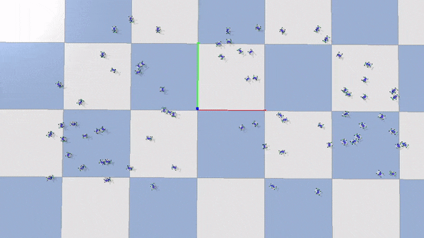
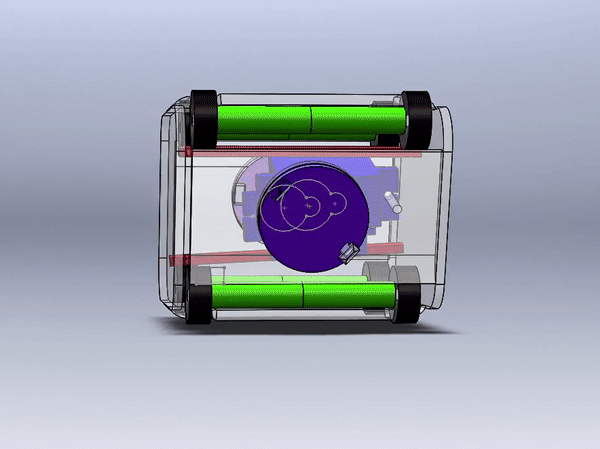
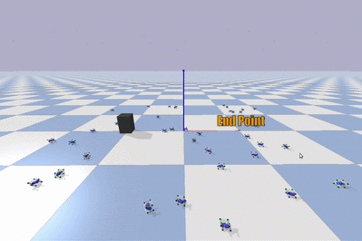

# gym-iOTA
This is an Open-AI gym environment developed with a modular bot platform named '**iOTA**'. The motive of this gym is to allow us to test out and develop Algorithms for such a MultiAgent System. This is further used to learn heirarchial planning of such a MultiAgent systems to develop a generalized swarm behaviour in the robots (i.e., Colabortively working towards achieving a objective). This is an project that is being developed under the **RoBoReG division of the Robotics Club, IIT Varanasi.**

Here the robot is designed in *SolidWorks* and being Simulated in *pybullet*.
<p align="center"></p><br/>
<p align="center">Here the robots where controlled to form into this specified constellation.</p>

## IOTA
</img>

This is a cost effective modular robot platform developed by us, This contains two docking plates enabling it to dock with other robots at those locations. This has got a very antique WW1 tank inspired designed which allows the bot too with enough traction when used with catpillar tracks.

For more info on the bot hardware and designs please visit this page [here](/hardware_Designs) or [doc](https://onedrive.live.com/view.aspx?resid=3B7945FE006E67D!4175&ithint=file%2cdocx&authkey=!AA_ziTqK6vYo80c)
<br/><br/>
## Installation
To install the latest features one could clone and install like so.
```bash
git clone https://github.com/Robotics-Club-IIT-BHU/gym-iOTA
cd gym-iOTA
pip install -e gym-iOTA
```
else for stable releases. the below would work fine.
```bash
pip install gym-iOTA
```
#### Depedencies
>gym<br/>
>pybullet<br/>
>opencv-python<br/>
>Pillow

## Usage
This environment can be accessed using gym api, and a small demo scipt is given below.
#### demo.py
```python
import gym
import gym_iOTA

env = gym.make('iOTA-v0',
                render=True,                  ## This runs the simulator in GUI mode
                no_of_modules=10,             ## This spawns so many no of robots
                no_of_clusters=10,            ## This is for subdividing the total no of robots in cluster for efficient accessing.
                arena=(2,2),                  ## This sets the dimension of the forseeable space for the system
                low_control=True,             ## This flag enables the low level control of the bot to the user.
                )
while True:
  action = np.ones((env.no_of_modules, 4))    ## Where for each row we have four velocities
  dock = np.zeros(
              (env.no_of_modules,
              env.no_of_modules))             ## This is the adjancy matrix storing all the docking relationships

  observation, reward, done, info = env.step(action, dock)

  observation                                 ## This is the coordinates+orientation of each bot
  env.render(mode='cluster')                  ## This would return the image and even render if was not in GUI mode earlier.

  if done:
    break
env.close()                                   ## simply removes all the docks and the bots and disconnects from the simulator.
```

## Objective
The objective of the environment is to use these robots to push the box from one side of the arena to the other. The below is a dry run with classical localization algorithm - **Particle Swarm Optimization Algorithm**.
<p align="center"> </p><br/>
<p align="center">Here the swarm of bots try to localize the box in the 3D environment</p><br/>

The Reward function is defined as the negetive of the distance between the position of the cube to the end point which is on the other side of the arena.
<p align="center"><a href="https://www.codecogs.com/eqnedit.php?latex=\dpi{150}&space;\bg_white&space;\fn_phv&space;\large&space;R&space;=&space;-&space;\sum&space;_{axes}&space;(Cube_{pos}&space;-&space;End_{pos})^{2}" target="_blank"></a>
</p>


## Info
This section contains details about the environment API's and utils available in it for developement.

#### `low_control` *(Boolean)* :
rather confusing term is present to allow the user to get low level control of individual bot that is the to set the desired velocities of each wheel touching the ground. else the environment would by itself control the robot and listen to the planner that plans trajectory to the given setpoint.

#### `env.action_space` *(gym.Box)* :
The action space varies if one chooses `low_control` to be **True** or **False**, if the low_control is set True then action space is vector of velocities of 4 wheel for each robot.<br/>
i.e., action_space shape = (no_of_modules, 4) <br/>
for each row [right_forward_wheel, left_forward_wheel, right_back_wheel, left_back_wheel] of that bot.

#### `env.dockMatrix` *(np.ndarray)* :
This contains all the joints or dockings that exist in the system, this a array containing if a bot is connected with another.<br/>
i.e., dockMatrix shape = (no_of_modules, no_of_modules)<br/>
So if **env.dockMatrix[i][j]** =  0 then it means there is no joint or docking between robot number i and j. similarly if **env.dockMatrix[i][j]** = 1 then it means these two robots are docked together.<br/>
**note** : **env.dockMatrix[i][j]** = **env.dockMatrix[j][i]** are same as they can have only one constrain between them. And no self docking is possible i.e., **env.dockMatrix[i][i]** = 1 is not possible.<br/>
We pass a similar matrix to <a href="#envstep-gymenvstep-">`env.step`</a> function where-in we denote new joints that we want to make.

#### `env.observation_space` *(gym.Box)* :
The observation space is simply vector of position and orientation of each robot.<br/>
i.e., observation_space shape = (no_of_modules, 6)<br/>
for each row [x_coor, y_coor, z_coor, roll, pitch, yaw] of that bot.

#### `env.iotas` *(class iOTA)* :
This is a list of robots that have been spawned into the simulator and gives us individual control over each robot. A list API's and variables are given [here](/gym-iOTA/gym_iOTA/envs). <br/>
The index of each robot in the list the robot number assigned to it which is the convection we use through out.
#### `env.step` *(gym.Env.step)* :
This takes in two inputs one action being the <a href="#envaction_space-gymbox-">`env.action_space`</a> and a dock matrix similar to the <a href="#envdockmatrix-npndarray-">`env.dockingMatrix`</a> <br/>
it returns the usual <br/>
*``` observation, reward, done, info ```*

#### `env.render` *(np.ndarray)* :
This returns the image of the top view of the arena. The image is also rendered using PIL's Image class if `mode = 'human'`

#### `env.close` *(gym.Env.close)*:
This simply removes all the joints and dockings and removes all the bodies and closes the connection to the physics server.

## The Team
<table>
 <td align="center">
     <a href="https://github.com/hex-plex">
    <br /><sub><b>Somnath Sendhil Kumar </b></sub></a><br />
    </td>
    <td align="center">
     <a href="https://github.com/surabhit-08">
    <br /><sub><b>Surabhit Gupta</b></sub></a><br />
	</td>
	<td align="center">
     <a href="https://github.com/rtharungowda">
    <br /><sub><b>R Tharun Gowda</b></sub></a><br />
	</td>
	<td align="center">
     <a href="https://github.com/Kritika-Bansal">
    <br /><sub><b>Kritika Bansal</b></sub></a><br />
	</td>

</table>

## Mentors
<table>
 <td align="center">
     <a href="https://github.com/lok-i">
    <br /><sub><b>Lokesh Krishna</b></sub></a><br />
    </td>
    <td align="center">
     <a href="https://github.com/NiranthS">
    <br /><sub><b>Niranth Sai</b></sub></a><br />
	</td>

</table>

## References
<a id="1">[1]</a>
**Swarmbot-Hardware**: Mondada, F., Pettinaro, G.C., Guignard, A. et al. Swarm-Bot: A New Distributed Robotic Concept. Autonomous Robots 17, 193–221 (2004). doi: 10.1023/B:AURO.0000033972.50769.1c.<br/>
This contains the Idea behind Swarmbot which was the bot we are inspired by. [[Link]](http://people.idsia.ch/~luca/swarmbot-hardware.pdf) & [[Video]](https://www.youtube.com/watch?v=77SEQ-kj8PI)<br/>
<a id="2">[2]</a>
**Self-reconfiguring modular robot.** This contains all the pre-existing works in Modular robots and information of their prototypes [[Wikipedia]](https://en.wikipedia.org/wiki/Self-reconfiguring_modular_robot)<br/>
<a id="3">[3]</a>
**SMORES-EP** : Researchers develop modular bots that combine to form a single flexible machine. This article contains few bot ideas we adopted [[Link]](https://www.engadget.com/2019-07-23-modular-robots-configure-smores.html)<br/>
<a id="4">[4]</a>
**Modular Self-Reconfiguring Robots** Rus Robotics laboratory's work in the field Modular Robots [[MIT]](https://groups.csail.mit.edu/drl/modular_robots/modular_robots.html).
<a id="5">[5]</a>
**An integrated system for perception-driven autonomy with modular robots** J. Daudelin, G. Jing, T. Tosun, et al. An integrated system for perception-driven autonomy with modular robots Science Robotics  31 Oct 2018: Vol. 3, Issue 23, eaat4983 DOI: 10.1126/scirobotics.aat4983 [[Link]](https://robotics.sciencemag.org/content/3/23/eaat4983.full?ijkey=iBq7yW7Z8vmjE&keytype=ref&siteid=robotics)<br/>
<a id="6">[6]</a>
**Symbrion** S. Kernbach, E. Meister, F. Schlauter, et al. Symbiotic robot organisms: Replicator and Symbrion projects January 2008 DOI: 10.1145/1774674.1774685 Conference: Proceedings of the 8th Workshop on Performance Metrics for Intelligent Systems. This is one such project from which we have been immensily inspired [[Paper]](https://www.researchgate.net/publication/234116421_Symbiotic_robot_organisms_Replicator_and_Symbrion_projects)<br/>
<a id="7">[7]</a>
**Modular Bot Algorithm** H. Ahmadzadeh, E. Masehian, Modular robotic systems: Methods and algorithms for abstraction, planning, control, and synchronization, Volume 223, 2015, Pages 27-64, ISSN 0004-3702, doi: 10.1016/j.artint.2015.02.004. [[Paper]](https://www.sciencedirect.com/science/article/pii/S0004370215000260)<br/>
<a id="8">[8]</a>
**KiloBots** by Self-Organizing Systems Research Group [[Link]](https://ssr.seas.harvard.edu/kilobots) This is the most simplest swarm system by which we were able to learn about the real problems that we would face in a MultiAgent System.<br/>
<a id="9">[9]</a>
**KiloBots-MARL** by Somnath Sendhil Kumar, This is a MultiAgent Reinforcement Learning solution presented for the Kilobots system [[Code]](https://github.com/hex-plex/KiloBot-MultiAgent-RL)<br/>
<a id="10">[10]</a>
**pyBullet**, This is the simulator that we used to simulate our Robots physics in and built The enviroment on top of it. [[Link]](https://pybullet.org/wordpress/) [[Docs]](https://docs.google.com/document/d/10sXEhzFRSnvFcl3XxNGhnD4N2SedqwdAvK3dsihxVUA/edit#heading=h.2ye70wns7io3) [[Code]](https://github.com/bulletphysics/bullet3)<br/>
<a id="11">[11]</a>
**Open-AI gym**, This framework connected the simulators to API's that are standard form in implementing Reinforcement Learning.
[[Link]](https://gym.openai.com/) [[Docs]](https://gym.openai.com/docs/) [[Code]](https://github.com/openai/gym)<br/>
<a id="12">[12]</a>
**Pybullet and OpenAI gym**, This is a tutorial which helps in implementing Pybullet as the backend with OpenAI gym, [[Link]](https://www.etedal.net/2020/04/pybullet-panda.html)
